# gopls-mcp 技术方案

## 一、背景

### 1.1 当前现状

在 AI 辅助编程领域，LLM（大语言模型）已广泛应用于代码生成、代码审查、问题解答等场景。然而，对于 Go 语言这类静态类型语言，LLM 在处理以下任务时仍存在明显不足：

- **精确的代码分析**：类型推断、接口实现、依赖关系分析
- **准确的错误诊断**：编译错误、类型不匹配、未使用的变量
- **深度的代码导航**：跳转定义、查找引用、跨包调用链
- **智能的代码补全**：基于类型系统的上下文补全
- **复杂的重构操作**：重命名符号、提取函数、安全删除

### 1.2 gopls 简介

**gopls** 是 Go 语言官方的 Language Server Protocol (LSP) 实现，提供了完整、准确的 Go 语言分析能力：

- 由 Go 官方团队维护，与 Go 语言同步演进
- 完整的类型系统和模块系统支持
- 支持泛型、go.work 工作区、cgo 等所有 Go 特性
- 已被 VS Code、Vim、Emacs 等主流编辑器广泛采用

### 1.3 MCP 协议

**Model Context Protocol (MCP)** 是 Anthropic 推出的开放协议，用于在 AI 应用和外部工具/数据源之间建立标准连接：

- 标准化的工具调用接口
- 支持 stdio、SSE 等多种传输方式
- 已有丰富的 Go SDK 支持
- 被 Claude Code、Cursor 等 AI 编程工具采用

---

## 二、痛点分析

### 2.1 LLM 的局限

| 痛点 | 描述 | 影响 |
|------|------|------|
| **静态分析能力弱** | LLM 只能通过代码模式匹配，无法真正理解类型系统 | 对泛型、接口、模块系统理解不准确 |
| **上下文限制** | 大型代码库无法完全放入上下文窗口 | 难以分析跨文件、跨包的依赖关系 |
| **幻觉问题** | LLM 可能编造不存在的 API 或错误信息 | 给出误导性的代码建议 |
| **无法实时反馈** | 无法获取最新的代码状态和编译错误 | 建议可能已过时 |

### 2.2 现有工具的局限

| 工具 | 局限 |
|------|------|
| **直接调用编译器** | 只能获取编译错误，无法做代码补全、跳转定义等 |
| **正则/静态分析** | 无法准确理解 Go 的类型系统和模块系统 |
| **在线 API（如 go.dev）** | 需要网络、有隐私问题、无法分析本地代码 |

### 2.3 开发者需求

开发者在日常工作中需要 AI 助手能够：

1. **精确回答代码问题**："这个函数在哪里被调用？"、"这个接口有哪些实现？"
2. **提供准确的代码建议**："如何补全这段代码？"、"这里有哪些错误？"
3. **执行复杂的重构**："将这个方法重命名并更新所有引用"
4. **理解项目结构**："这个包的依赖关系如何？"、"项目的核心模块有哪些？"

---

## 三、目标

### 3.1 核心目标

构建一个 **基于 gopls 的 MCP CLI 客户端**，将 gopls 的专业 Go 语言分析能力通过 MCP 协议暴露给 LLM，使 AI 助手能够：

- ✅ 精确分析 Go 代码（类型、依赖、结构）
- ✅ 准确诊断代码问题（编译错误、警告、建议）
- ✅ 智能补全和重构（基于类型系统）
- ✅ 深度代码导航（定义、引用、调用链）
- ✅ 支持所有 Go 特性（泛型、模块、cgo、go.work）

### 3.2 非目标

- ❌ 不实现代码编辑功能（应由编辑器/IDE 完成）
- ❌ 不替代 gopls 本身（只是作为 LSP 客户端）
- ❌ 不支持其他语言（专注于 Go）

### 3.3 成功标准

| 指标 | 目标 |
|------|------|
| **功能覆盖率** | 覆盖 gopls 核心能力的 80%+ |
| **响应时间** | 单次工具调用 < 500ms（冷启动除外） |
| **准确率** | 代码诊断准确率 > 95% |
| **兼容性** | 支持 Go 1.18+（含泛型）、go.work |

---

## 四、解决方案

### 4.1 总体思路

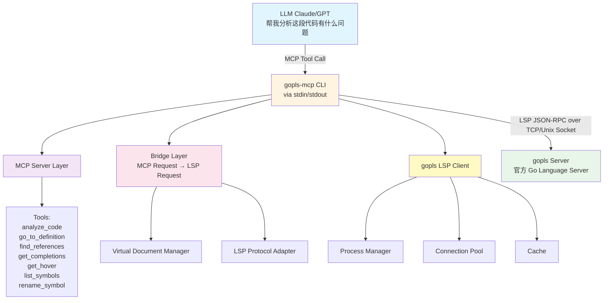

### 4.2 核心设计

#### 4.2.1 架构分层

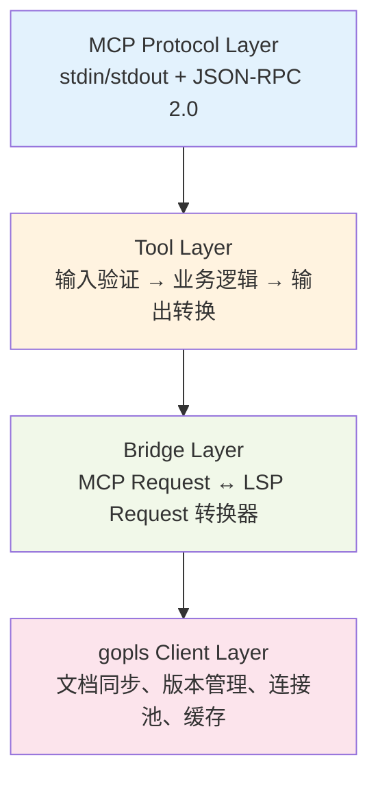

#### 4.2.2 关键设计决策

| 决策点 | 选择 | 理由 |
|--------|------|------|
| **传输协议** | MCP stdio | 标准协议、兼容性好、低延迟 |
| **gopls 连接** | TCP/Unix Socket | LSP 标准、支持并发 |
| **文档管理** | 虚拟文件系统 | 无需写入磁盘、支持临时代码 |
| **并发模型** | goroutine + 连接池 | 高效复用 gopls 进程 |
| **缓存策略** | 文档版本 + 结果缓存 | 减少 LSP 调用、提升性能 |

---

## 五、业务架构图

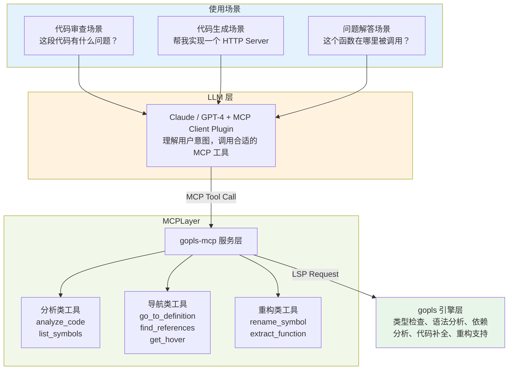

---

## 六、技术架构图

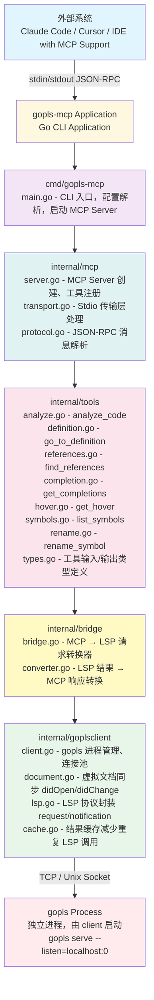

---

## 七、组件流程图

### 7.1 完整调用流程

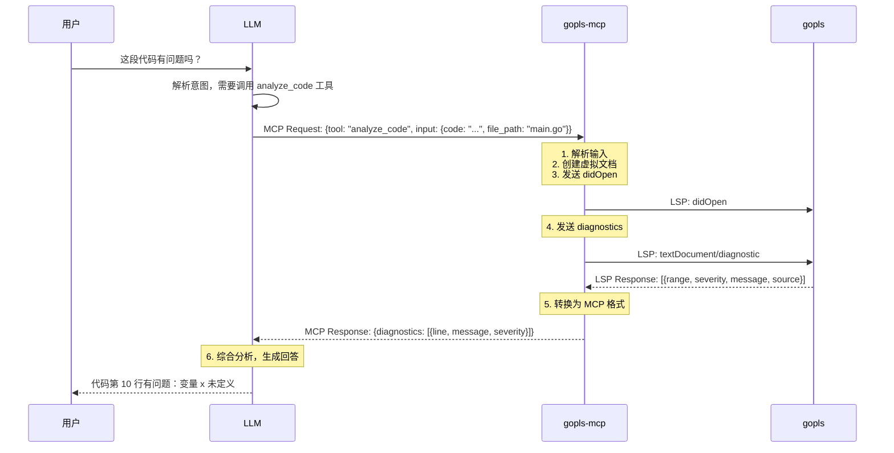

### 7.2 核心组件交互

#### Tool Handler 流程

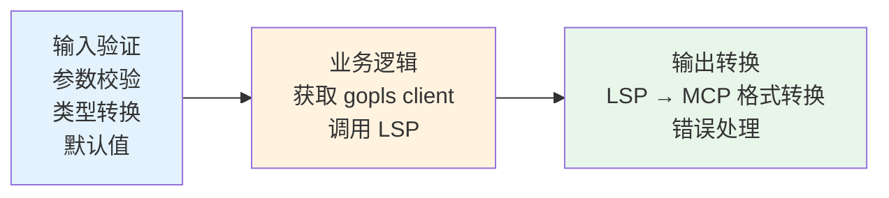

#### Virtual Document Manager

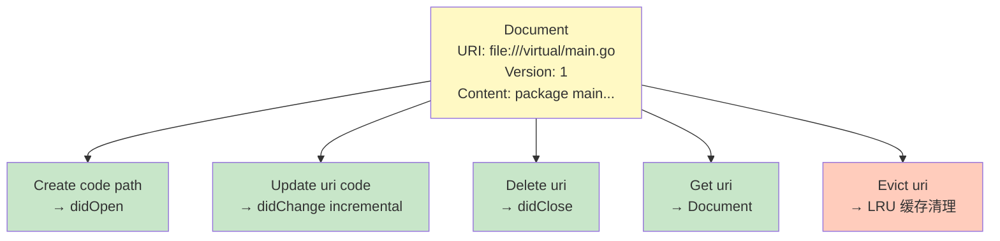

#### gopls Connection Pool

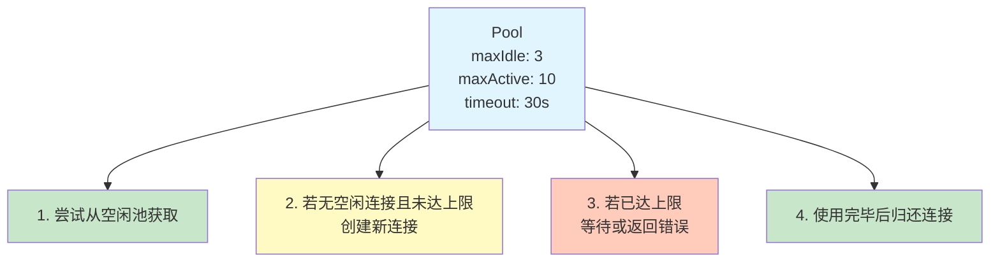

#### Result Cache

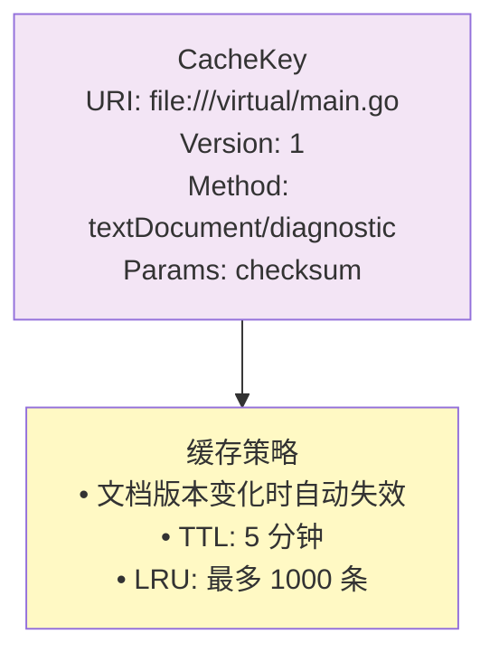

### 7.3 关键数据流

#### MCP Request → LSP Request

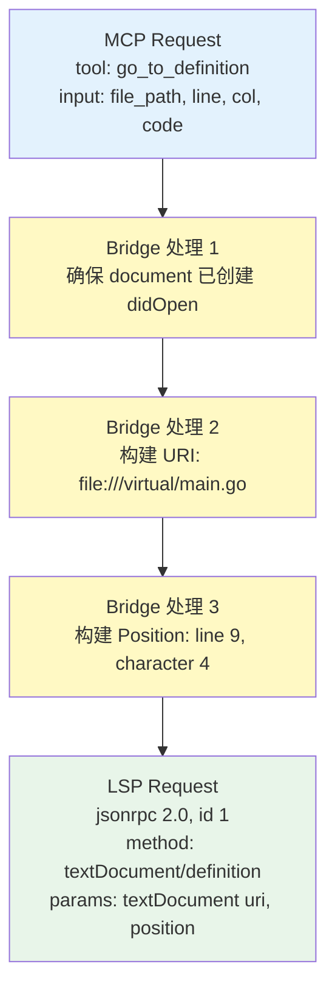

#### LSP Response → MCP Response

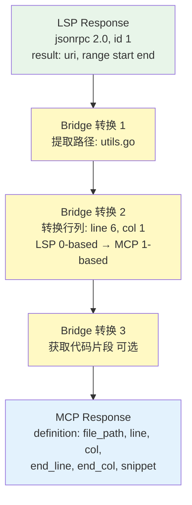

---

## 八、工具定义

### 8.1 工具清单

| 工具名称 | 功能描述 | LSP 映射 | 优先级 | 来源 |
|---------|---------|----------|--------|------|
| **analyze_code** | 分析代码并返回诊断信息 | `textDocument/diagnostic` | P0 | 原有 |
| **go_to_definition** | 跳转到符号定义 | `textDocument/definition` | P0 | 原有 |
| **find_references** | 查找符号引用 | `textDocument/references` | P0 | 原有 |
| **get_hover** | 获取悬停文档信息 | `textDocument/hover` | P1 | 原有 |
| **list_symbols** | 列出文件中的符号（支持层级） | `textDocument/documentSymbol` | P1 | 借鉴 Serena |
| **search_symbols** | 按名称路径模式搜索符号 | `workspace/symbol` | P1 | 🆕 借鉴 Serena |
| **get_completions** | 获取代码补全建议 | `textDocument/completion` | P1 | 原有 |
| **search_pattern** | 正则表达式搜索代码 | 自实现 | P2 | 🆕 借鉴 Serena |
| **rename_symbol** | 重命名符号 | `textDocument/rename` | P2 | 原有 |
| **format_code** | 格式化代码 | `textDocument/formatting` | P2 | 原有 |
| **fix_code** | 自动修复问题 | `textDocument/codeAction` | P2 | 原有 |
| **get_call_hierarchy** | 获取调用层次结构 | `callHierarchy/incomingCalls` | P2 | 🆕 新增 |
| **list_packages** | 列出项目的包结构 | 自实现 | P2 | 🆕 新增 |

### 8.2 从 Serena 借鉴的设计模式

#### 8.2.1 名称路径模式

借鉴 Serena 的 `name_path` 设计，支持灵活的符号匹配：

```
# 简单名称：匹配任何同名符号
"HandleRequest"

# 相对路径：匹配后缀
"http/HandleRequest"  → 匹配 ...http.HandleRequest

# 绝对路径：精确匹配
"/github.com/user/pkg/HandleRequest"

# Go 特有：包路径符号
"net/http.ListenAndServe"
```

#### 8.2.2 通用参数模式

借鉴 Serena 的参数设计风格：

| 参数名 | 类型 | 默认值 | 说明 |
|--------|------|--------|------|
| `depth` | int | 0 | 检索深度（0=当前层级，1=直接子元素） |
| `include_body` | bool | false | 是否包含符号体 |
| `include_info` | bool | false | 是否包含文档和签名 |
| `include_kinds` | []string | nil | 包含的符号类型过滤 |
| `exclude_kinds` | []string | nil | 排除的符号类型过滤 |
| `max_results` | int | 100 | 最大返回结果数 |
| `max_chars` | int | -1 | 最大返回字符数（-1=无限制） |

### 8.3 详细定义

#### 8.2.1 analyze_code

**功能**：分析 Go 代码，返回编译错误、类型错误、警告等诊断信息

**输入**：

```json
{
  "code": "package main\n\nfunc main() {\n    var x int\n    println(y)\n}",
  "file_path": "main.go",
  "include_warnings": true
}
```

**输出**：

```json
{
  "file_path": "main.go",
  "diagnostics": [
    {
      "line": 4,
      "col": 12,
      "end_line": 4,
      "end_col": 13,
      "severity": "error",
      "message": "undefined: y",
      "code": "undeclaredname",
      "source": "gopls",
      "suggestion": "Did you mean 'x'?"
    }
  ]
}
```

#### 8.2.2 go_to_definition

**功能**：跳转到符号的定义位置

**输入**：

```json
{
  "code": "package main\n\nfunc hello() {}\n\nfunc main() {\n    hello()\n}",
  "file_path": "main.go",
  "line": 5,
  "col": 5
}
```

**输出**：

```json
{
  "definition": {
    "file_path": "main.go",
    "line": 3,
    "col": 1,
    "end_line": 3,
    "end_col": 13,
    "name": "hello",
    "kind": "function",
    "signature": "func hello()"
  }
}
```

#### 8.2.3 find_references

**功能**：查找符号的所有引用位置

**输入**：

```json
{
  "code": "...",
  "file_path": "main.go",
  "line": 3,
  "col": 6,
  "include_declaration": true
}
```

**输出**：

```json
{
  "symbol": {
    "name": "hello",
    "kind": "function"
  },
  "references": [
    {
      "file_path": "main.go",
      "line": 3,
      "col": 6,
      "is_definition": true
    },
    {
      "file_path": "main.go",
      "line": 6,
      "col": 5,
      "is_definition": false
    }
  ],
  "total_count": 2
}
```

#### 8.2.4 get_hover

**功能**：获取符号的悬停文档信息

**输入**：

```json
{
  "code": "...",
  "file_path": "main.go",
  "line": 6,
  "col": 5
}
```

**输出**：

```json
{
  "hover": {
    "range": {
      "line": 6,
      "col": 5,
      "end_line": 6,
      "end_col": 10
    },
    "contents": {
      "signature": "func hello()",
      "documentation": "hello prints a greeting",
      "kind": "function"
    }
  }
}
```

#### 8.3.5 list_symbols（🆕 借鉴 Serena）

**功能**：列出文件中的所有符号（函数、类型、变量等），支持层级控制

**输入**：

```json
{
  "code": "package main\n\ntype Config struct {\n    Host string\n}\n\nfunc (c *Config) Run() {}\n\nfunc main() {}",
  "file_path": "main.go",
  "depth": 1,
  "include_body": false,
  "include_info": true,
  "include_kinds": ["struct", "function", "method"],
  "max_results": 50
}
```

**输出**：

```json
{
  "symbols": [
    {
      "name": "Config",
      "name_path": "Config",
      "kind": "struct",
      "line": 3,
      "col": 1,
      "end_line": 5,
      "end_col": 2,
      "signature": "type Config struct",
      "children": [
        {"name": "Host", "name_path": "Config.Host", "kind": "field", "line": 4}
      ]
    },
    {
      "name": "Run",
      "name_path": "Config.Run",
      "kind": "method",
      "line": 6,
      "col": 14,
      "signature": "func (c *Config) Run()",
      "receiver": "Config"
    },
    {
      "name": "main",
      "name_path": "main",
      "kind": "function",
      "line": 8,
      "col": 1,
      "signature": "func main()"
    }
  ],
  "total_count": 3
}
```

#### 8.3.6 search_symbols（🆕 新增）

**功能**：按名称路径模式搜索符号（借鉴 Serena）

**输入**：

```json
{
  "code": "...",
  "name_path_pattern": "http/Handle",
  "substring_matching": true,
  "include_kinds": ["function", "method"],
  "max_results": 20
}
```

**输出**：

```json
{
  "matches": [
    {
      "name": "HandleFunc",
      "name_path": "net/http/HandleFunc",
      "kind": "function",
      "file_path": "net/http/server.go",
      "line": 58,
      "signature": "type HandleFunc func(ResponseWriter, *Request)",
      "match_score": 0.95
    },
    {
      "name": "Handle",
      "name_path": "net/http/Handle",
      "kind": "function",
      "file_path": "net/http/server.go",
      "line": 42,
      "signature": "func Handle(pattern string, handler Handler)",
      "match_score": 0.92
    }
  ]
}
```

#### 8.3.7 search_pattern（🆕 新增）

**功能**：使用正则表达式在代码中搜索模式（借鉴 Serena）

**输入**：

```json
{
  "code": "package main\n\nfunc main() {\n    if err := doSomething(); err != nil {\n        log.Fatal(err)\n    }\n}",
  "file_path": "main.go",
  "pattern": "if\\s+\\w+\\s*:=\\s*\\w+\\(\\);\\s*\\w+\\s*!=\\s*nil",
  "context_lines_before": 2,
  "context_lines_after": 2
}
```

**输出**：

```json
{
  "matches": [
    {
      "file_path": "main.go",
      "line": 3,
      "col": 5,
      "matched_text": "if err := doSomething(); err != nil {",
      "context_before": ["func main() {"],
      "context_after": ["        log.Fatal(err)", "    }"]
    }
  ]
}
```

#### 8.3.8 get_call_hierarchy（🆕 新增）

**功能**：获取函数的调用层次结构

**输入**：

```json
{
  "code": "...",
  "file_path": "main.go",
  "line": 10,
  "col": 5,
  "direction": "incoming",
  "depth": 2
}
```

**输出**：

```json
{
  "symbol": {
    "name": "processRequest",
    "name_path": "processRequest",
    "kind": "function"
  },
  "callers": [
    {
      "name": "main",
      "name_path": "main",
      "file_path": "main.go",
      "line": 25,
      "calls": ["processRequest"]
    },
    {
      "name": "handleRequest",
      "name_path": "handleRequest",
      "file_path": "handler.go",
      "line": 12,
      "calls": ["processRequest", "validateRequest"]
    }
  ]
}
```

#### 8.3.9 list_packages（🆕 新增）

**功能**：列出项目的包结构和依赖关系

**输入**：

```json
{
  "code": "...",
  "include_dependencies": true,
  "depth": 1
}
```

**输出**：

```json
{
  "packages": [
    {
      "name": "main",
      "path": "github.com/user/project",
      "kind": "command",
      "dependencies": ["net/http", "github.com/gin-gonic/gin"]
    },
    {
      "name": "handler",
      "path": "github.com/user/project/handler",
      "kind": "package",
      "dependencies": ["net/http", "../model"]
    }
  ]
}
```

---

## 九、分阶段任务拆解

### 项目总览甘特图

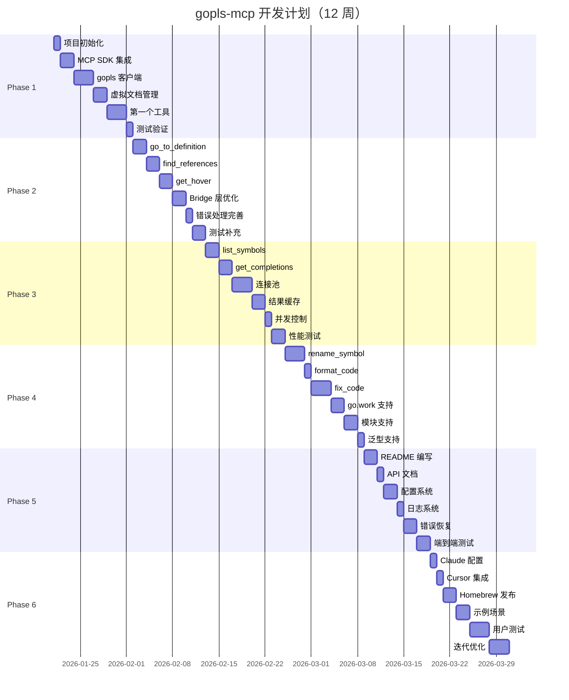

### Phase 1: 基础框架搭建（Week 1-2）

**目标**：建立可运行的 MCP Server 框架，实现一个基础工具

| 任务             | 描述                        | 交付物                | 估时   |
| -------------- | ------------------------- | ------------------ | ---- |
| 1.1 项目初始化      | 创建项目结构、配置 go.mod          | 项目骨架               | 0.5d |
| 1.2 MCP SDK 集成 | 集成 go-sdk/mcp，实现 stdio 传输 | 可运行的 MCP Server    | 1d   |
| 1.3 gopls 客户端  | 实现基础的 gopls 进程启动和 LSP 连接  | goplsclient.Client | 2d   |
| 1.4 虚拟文档管理     | 实现文档创建/更新/删除的 LSP 同步      | document.Manager   | 1d   |
| 1.5 第一个工具      | 实现 analyze_code 工具        | analyze_code 可用    | 2d   |
| 1.6 测试验证       | 编写单元测试，手动验证 MCP 调用        | 测试报告               | 0.5d |

**里程碑**：能够通过 MCP 调用 analyze_code 并返回诊断结果

---

### Phase 2: 核心工具实现（Week 3-4）

**目标**：实现 P0 优先级的导航和查询工具

| 任务 | 描述 | 交付物 | 估时 |
|------|------|--------|------|
| 2.1 go_to_definition | 实现跳转定义工具 | go_to_definition | 1.5d |
| 2.2 find_references | 实现查找引用工具 | find_references | 1.5d |
| 2.3 get_hover | 实现悬停信息工具 | get_hover | 1d |
| 2.4 Bridge 层优化 | 提取公共转换逻辑，减少重复代码 | bridge.Converter | 1d |
| 2.5 错误处理完善 | 统一错误处理，增加友好提示 | 错误处理中间件 | 0.5d |
| 2.6 测试补充 | 补充工具的单元测试和集成测试 | 测试报告 | 1d |

**里程碑**：P0 工具全部可用，基本满足 Go 代码分析需求

---

### Phase 3: 增强功能（Week 5-6）

**目标**：实现更多高级功能和性能优化

| 任务 | 描述 | 交付物 | 估时 |
|------|------|--------|------|
| 3.1 list_symbols | 实现符号列表工具 | list_symbols | 1d |
| 3.2 get_completions | 实现代码补全工具 | get_completions | 1.5d |
| 3.3 连接池 | 实现 gopls 连接复用 | connection.Pool | 2d |
| 3.4 结果缓存 | 实现 LSP 查询结果缓存 | cache.Manager | 1.5d |
| 3.5 并发控制 | 限制并发 LSP 请求数，防止过载 | 限流器 | 0.5d |
| 3.6 性能测试 | 压力测试，优化响应时间 | 性能报告 | 1d |

**里程碑**：功能完整，性能满足要求（<500ms）

---

### Phase 4: 高级功能（Week 7-8）

**目标**：实现重构类工具和特殊场景支持

| 任务 | 描述 | 交付物 | 估时 |
|------|------|--------|------|
| 4.1 rename_symbol | 实现重命名工具 | rename_symbol | 2d |
| 4.2 format_code | 实现格式化工具 | format_code | 0.5d |
| 4.3 fix_code | 实现自动修复工具（codeAction） | fix_code | 2d |
| 4.4 go.work 支持 | 支持 Go 工作区 | go.work 文档 | 1d |
| 4.5 模块支持 | 完善多模块项目支持 | 测试用例 | 1d |
| 4.6 泛型支持 | 验证泛型相关场景 | 测试报告 | 0.5d |

**里程碑**：功能覆盖率达 80%+，支持所有 Go 特性

---

### Phase 5: 质量优化和文档（Week 9-10）

**目标**：完善文档、提升稳定性

| 任务 | 描述 | 交付物 | 估时 |
|------|------|--------|------|
| 5.1 README 编写 | 完善项目文档、使用说明 | README.md | 1d |
| 5.2 API 文档 | 生成工具 API 文档 | API 文档 | 0.5d |
| 5.3 配置系统 | 支持配置文件 | config 设计 | 1d |
| 5.4 日志系统 | 完善日志输出 | logger 实现 | 0.5d |
| 5.5 错误恢复 | gopls 崩溃自动重启 | 健康检查 | 1d |
| 5.6 端到端测试 | 编写完整的 E2E 测试 | E2E 测试 | 1d |

**里程碑**：项目可发布 v1.0.0

---

### Phase 6: 部署和集成（Week 11-12）

**目标**：集成到 AI 编程工具，收集反馈

| 任务 | 描述 | 交付物 | 估时 |
|------|------|--------|------|
| 6.1 Claude 配置 | 编写 Claude MCP 配置文档 | 配置示例 | 0.5d |
| 6.2 Cursor 集成 | 测试 Cursor 集成 | 集成文档 | 0.5d |
| 6.3 Homebrew 发布 | 发布到 Homebrew | Formula | 1d |
| 6.4 示例场景 | 编写使用示例和视频 | 示例仓库 | 1d |
| 6.5 用户测试 | 邀请用户试用，收集反馈 | 反馈报告 | 2d |
| 6.6 迭代优化 | 根据反馈修复问题 | bugfix | 2d |

**里程碑**：成功发布并有一定用户基础

---

## 十、技术风险和应对

| 风险 | 影响 | 概率 | 应对措施 |
|------|------|------|----------|
| **gopls 稳定性问题** | 高 | 中 | 实现健康检查和自动重启，连接池隔离 |
| **LSP 协议复杂性** | 中 | 高 | 使用成熟库（go-lsp），逐步实现 |
| **性能瓶颈** | 中 | 中 | 连接池、缓存、异步处理 |
| **MCP SDK 变更** | 低 | 低 | 锁定版本，关注上游更新 |
| **Go 版本兼容性** | 中 | 低 | 支持 Go 1.18+，测试多个版本 |

---

## 十一、成功指标

| 指标 | 目标 | 测量方式 |
|------|------|----------|
| **功能覆盖率** | ≥ 80% | gopls 能力矩阵对比 |
| **响应时间** | P50 < 200ms, P95 < 500ms | 性能测试 |
| **诊断准确率** | ≥ 95% | 与 go compiler 对比 |
| **内存占用** | < 100MB (idle) | 资源监控 |
| **用户满意度** | ≥ 4.0/5.0 | 用户反馈 |

---

## 十二、参考资源

- **bcindex 项目**：https://github.com/DreamCats/bcindex
- **MCP 官方文档**：https://modelcontextprotocol.io
- **MCP Go SDK**：https://github.com/modelcontextprotocol/go-sdk
- **gopls 官方文档**：https://golang.org/x/tools/gopls
- **LSP 规范**：https://microsoft.github.io/language-server-protocol/

---

## 附录：MCP 配置示例

### Claude Desktop 配置

```json
{
  "mcpServers": {
    "gopls": {
      "command": "/path/to/gopls-mcp",
      "args": []
    }
  }
}
```

### Cursor 配置

```json
{
  "mcpServers": [
    {
      "name": "gopls",
      "command": "/path/to/gopls-mcp",
      "args": []
    }
  ]
}
```

---

**文档版本**：v1.0
**创建日期**：2026-01-21
**作者**：Claude Code & 买峰
